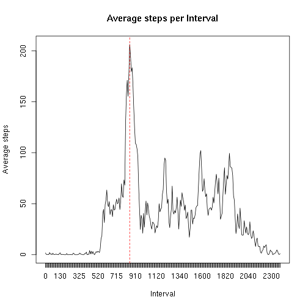
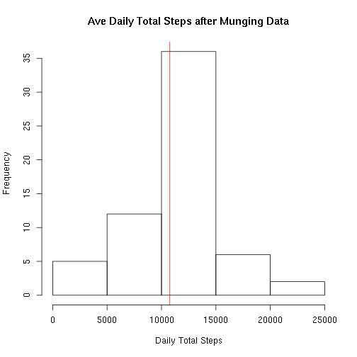
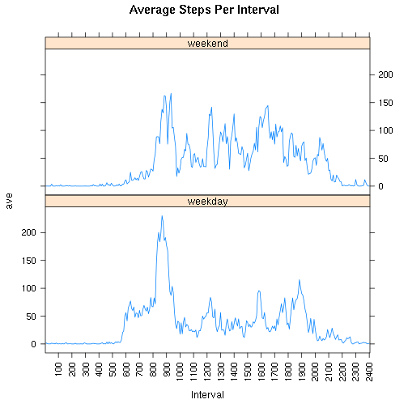

# Reproducible Research: Peer Assessment 1

This is an exercise in "reproducible research"
No claim is made that the analysis is error free.
The purpose is that by applying _my_ methods to _my_ data, you will get _my_ results, errors and all.
We will then have some common ground to discuss the errors.

So as long as you can reproduce all my errors, all is well!
## Loading and preprocessing the data
I use the library "_lubridate_" to handle the dates. I treat the intervals as ordered factors as this is sufficient for my purposes.
I make my life slightly more difficult by generating these myself. The reason is to ensure there are no missing values and that they are in order.


```r
step.data <- read.csv(unzip("activity.zip"))    # This file should be in the local directory
library(lubridate)                              # A useful date library

# Tame the data.
# The interval data is a set of 5 minute time period throughout the day.
# There is a possibility that some are missing or appear out of order.
# To reduce the effect of this I create my own known ordered set of factors.
s = sprintf("%d%02d",rep(0:23, each=12),seq(0,55,5))    # create the intervals
f = factor(sort(as.numeric(s)), ordered=TRUE)           # order as numeric. 0 5 10 ...

# The date data is converted to POSIXct so I can select based on date
step.data = transform(step.data, date=ymd(date), interval = factor(interval, levels=f))
```


## What is mean total number of steps taken per day?
To calculate the mean total number of steps per day, I must first calculate the total number of steps per day.

```r
# make a simple tally function for no other reason than to save cutting and
# pasting later and possibly stuffing up.
tally.steps = function(data) {
# aggregate steps by date, taking the sum
        totals = aggregate(list(steps=data$steps), 
              by=list(date=data$date), 
              FUN=function(x){sum(x, na.rm=T)})   # Just ignore missing values
        totals
              }

original.total = tally.steps(step.data)
rounding=2                                  # round answers to 2 decimal places
sprintf("mean is %s steps", as.character(round(mean(original.total$steps), rounding)))
```

```
## [1] "mean is 9354.23 steps"
```

```r
sprintf("median is %d steps", median(original.total$steps))
```

```
## [1] "median is 10395 steps"
```


The question asks for a histogram (a frequency graph), not a bar graph.


```r
# I make this a function so it can be reused for a later question
step.histogram = function(data, title="Daily Total Steps"){
# produce a histogram of my tally object
# which contains a column named steps)
     hist(data$steps,
         main=title,
         xlab="Daily Total Steps")
     abline(v=mean(data$steps), col="red")       # identify the mean with a vertical line
}

step.histogram(original.total)
```

 


The mean number of total steps per day is __9354.23__ steps, rounded to 2 decimal places.
The median number of total steps taken each day is __10395__ steps.


## What is the average daily activity pattern?


```r
# aggregate by interval for any day and average these
step.ave.per.interval = with(step.data,
                            aggregate(list(ave=steps),
                                      by=list(interval=interval), 
                                      function(x) mean(x, na.rm=TRUE)))
# 
max.average.steps = max(step.ave.per.interval$ave)
max.average.interval = step.ave.per.interval[
                       step.ave.per.interval$ave==max.average.steps,"interval"]
# to produce a nice line instead of points, I revert the interval factors back to numeric
with(step.ave.per.interval, plot(x=as.numeric(interval), y=ave, 
               main="Average steps per Interval",
               xlab="Interval",
               ylab="Average steps",
               type="l", xaxt="n"))
axis(1,at=f, labels=f)
abline(v=max.average.interval, col="red", lty=2)
```

 

```r
sprintf("The maximum average steps occurs in interval %s", max.average.interval)
```

```
## [1] "The maximum average steps occurs in interval 835"
```

The maximum average number of steps, averaged across all days occurs during time period __835__ with an average of 206.17 steps.


## Imputing missing values
To calculate the number of rows missing data, I simply sum the rows where where the number of steps is NA.


```r
rows.missing = sum(is.na(step.data$steps))
sprintf("%d rows contain missing data", rows.missing)
```

```
## [1] "2304 rows contain missing data"
```
There are __2304__ rows containing NA steps.

I choose a strategy for filling in missing values with the average value for the five minute period across all days where it exists.
There is a possibility that this value may also be NA, but I deliberately ignore this possibility as it does not occur with my data.

This creates a slight problem with the number of steps in each period no longer being an integer.
The median will no longer necessarily be a whole or half step.
The distribution will become more symmetric.

I make no justification for this approach and do not argue that there are no better methods.
It is just an exercise in replacing the missing data.


```r
# already have the interval averages 
fixed = step.data                                  # copy the original data.frame
fixed$steps = ifelse(!is.na(step.data$steps),      # and update the steps column 
               step.data$steps,                    # use the available data if present
               step.ave.per.interval$ave)          # else substitute the average for this interval.
fixed.total = tally.steps(fixed)
#
# use the same plotting function as previously
step.histogram(fixed.total, title="Ave Daily Total Steps after Munging Data")                        
```

 

```r
sprintf("The mean total daily steps is %s", as.character(round(mean(fixed.total$steps), rounding)))
```

```
## [1] "The mean total daily steps is 10766.19"
```

```r
sprintf("The median total daily steps is %s", as.character(round(median(fixed.total$steps), rounding)))
```

```
## [1] "The median total daily steps is 10766.19"
```
This plot shows that _"fixing"_ the missing data makes a significant difference.
I don't know if this is a good thing.
## Are there differences in activity patterns between weekdays and weekends?
The assignment specifies I use the filled in data.
The differences between weekday activity are clear from the plots below.
For a start, things start earlier on weekdays.


```r
# My definition of weekend is Saturday or Sunday.
# I am not interested in public holidays, locales, etc

# Add a day.type factor
fixed$day.type = factor(ifelse(weekdays(step.data$date) %in% c("Saturday", "Sunday"), "weekend","weekday"))
data = with(fixed, aggregate(list(ave=steps), by=list(Interval=interval, dt=day.type), FUN=mean))

# perhaps it would have been easier to have Intervals as time rather than factors.
library("lattice")                            # load plotting library
xyplot(ave~Interval|dt, data=data,            # plot the weekday vs weekend data
                        type="l", 
                        layout=c(1,2), 
                        main="Average Steps Per Interval",
                        scales=list(x=list(at=seq(0,288,12), 
                                           labels=seq(0,2400,100), 
                                           rot=90)))
```

 
